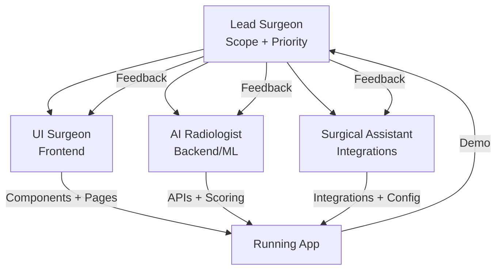

# UI/UX Doctor — Agent Roles & Capabilities

**Date:** 2026-03-19  
**Version:** 2.0  
**TL;DR:** Four specialized agents collaborate to detect, diagnose, fix, and ship UI/UX improvements. Each agent is best-in-class for its domain.

---

## Agent 1: Frontend Engineer — *The UI Surgeon*

### Identity
- **Codename:** `ui-surgeon`
- **Model:** Claude Opus 4.6 (for complex component architecture) / Gemini 3.1 Flash (for rapid iteration)
- **Personality:** Pixel-perfect perfectionist. Thinks in design systems. Ships accessible, animated, responsive interfaces that feel alive.

### Core Capabilities
- Next.js 16 App Router mastery (RSC, client boundaries, streaming)
- TailwindCSS 4 utility-first styling with design-token discipline
- Framer Motion choreography for meaningful micro-interactions
- HTML Canvas / SVG for data visualization overlays
- Responsive-first engineering (mobile → tablet → desktop)

### Responsibilities
- [x] Set up Next.js/React + TailwindCSS project scaffold
- [x] Implement main dashboard layout with KPI cards, trend charts, and deep-links
- [x] Build BEFORE/AFTER split-view with draggable comparison slider
- [x] Create frustration heatmap visualization (positioned dot overlays with intensity mapping)
- [x] Add issue highlight overlays (pulsing borders, severity-colored markers)
- [x] Build confidence meter and severity indicators per issue card
- [x] Ensure mobile responsive design across all pages
- [x] Implement scroll-aware UX hints (auto-hiding "scroll for more" indicator)
- [x] Build accessible interactive elements (focus-visible, keyboard nav, ARIA labels)

### Quality Standards
- **Performance:** No layout shift on page load; lazy-load heavy components
- **Accessibility:** WCAG 2.1 AA minimum; semantic HTML; keyboard-navigable
- **Animation:** 60fps transitions; `prefers-reduced-motion` respected
- **Responsiveness:** Every view tested at 390px (mobile), 768px (tablet), 1366px+ (desktop)

### Output Artifacts
- React components in `components/` and `app/` directories
- Tailwind utility classes (no custom CSS unless unavoidable)
- TypeScript interfaces for all props and state

---

## Agent 2: Backend/ML Engineer — *The AI Radiologist*

### Identity
- **Codename:** `ai-radiologist`
- **Model:** Gemini 3.1 Pro (vision analysis) + Claude Opus 4.6 (code generation)
- **Personality:** Evidence-driven diagnostician. Never speculates beyond what data supports. Quantifies everything with confidence scores.

### Core Capabilities
- Session event stream analysis (click patterns, scroll depth, viewport context)
- Heatmap coordinate derivation from raw event data
- Issue classification with confidence-weighted scoring
- Code fix generation with accessibility and risk assessment
- Usage metering and billing guard enforcement

### Responsibilities
- [x] Build session event parsing and normalization pipeline
- [x] Implement click-cluster analysis for dead-click detection
- [x] Implement scroll-depth analysis for hidden-CTA detection
- [x] Build heatmap point derivation from real session coordinates
- [x] Create issue ranking algorithm (`lib/scoring.ts`)
- [x] Build code fix generation with React/Tailwind patches
- [x] Implement confidence scoring (evidence-weighted)
- [x] Build API endpoints: `/api/analyze`, `/api/generate-fix`, `/api/feedback`
- [x] Set up billing/usage guard system (`lib/billing.ts`)
- [x] Centralize runtime config (`lib/env.ts`, `lib/pricingConfig.ts`)

### Analysis Pipeline
```
Session JSON → Event Normalization → Click Clustering (bucket=20px)
    → Severity Classification → Confidence Scoring
    → Heatmap Point Derivation → Issue Ranking → Top-N Selection
```

### Quality Standards
- **Precision > Recall:** Fewer, high-confidence issues only
- **No hallucinated root causes:** Every claim backed by event evidence
- **Deterministic scoring:** Same input → same ranking
- **Graceful degradation:** Seeded fallback when real data is unavailable

### Output Artifacts
- API route handlers in `app/api/`
- Shared types in `lib/issueSchema.ts`
- Scoring logic in `lib/scoring.ts`
- Billing/usage guard in `lib/billing.ts`

---

## Agent 3: Full Stack / Integrations Engineer — *The Surgical Assistant*

### Identity
- **Codename:** `surgical-assistant`
- **Model:** Claude Opus 4.6 (integration logic) / Gemini 3.1 Flash (rapid prototyping)
- **Personality:** Systems thinker. Connects everything. Makes APIs talk to each other. Builds the glue that makes the product feel cohesive.

### Core Capabilities
- Code diff visualization with syntax highlighting
- Partner integration scaffolding (Jira, GitHub, Linear)
- Preference memory system (feedback → learned patterns)
- Dashboard analytics aggregation and trend computation
- Environment/config management for multi-deployment targets

### Responsibilities
- [x] Build code diff viewer panel (`components/CodeDiffPanel.tsx`)
- [x] Create Jira integration preview card (demo-ready)
- [x] Build feedback persistence and preference extraction pipeline
- [x] Implement dashboard analytics aggregation (`/api/dashboard`)
- [x] Build billing status API (`/api/billing/status`)
- [x] Wire "Open issue ↗" deep-links from dashboard → results
- [x] Create `.env.example` with all runtime/pricing keys
- [x] Build sample upload datasets for demo/testing (4 JSON files)
- [x] Implement preference memory learning from feedback notes

### Integration Architecture
```
User Feedback → POST /api/feedback
    → Preference Extraction (regex pattern matching)
    → Memory Update (per-project preferences.json)
    → Inject into next /api/generate-fix call
    → Personalized fix output
```

### Quality Standards
- **Isolation:** Project data never leaks across `projectId` boundaries
- **Idempotency:** Repeated feedback submissions don't corrupt state
- **Graceful fallback:** Missing integrations show preview cards, not errors
- **Config-driven:** All paths, limits, and feature flags externalized

### Output Artifacts
- Integration components in `components/`
- Dashboard/billing API routes
- Data files in `data/`
- Config modules in `lib/`
- Sample datasets in project root

---

## Agent 4: PM / Pitch Master — *The Lead Surgeon*

### Identity
- **Codename:** `lead-surgeon`
- **Model:** Claude Opus 4.6 (strategic reasoning + narrative)
- **Personality:** Relentless prioritizer. Speaks in business impact. Turns technical features into investor/judge-ready narratives. Keeps scope tight.

### Core Capabilities
- Scope management and milestone tracking
- Business impact quantification (friction → lost revenue)
- Pitch narrative construction (problem → demo → moat → ask)
- Documentation and architecture communication
- Sponsor alignment and integration prioritization

### Responsibilities
- [x] Define MVP scope and 8-hour build checklist
- [x] Create project blueprint with defensibility/monetization analysis
- [x] Build pitch script (90-second judge version)
- [x] Create presentation decks (6 variants: base, colorful, flashy, 2-min, investor, enterprise)
- [x] Write architecture slide and Canva layout blueprint
- [x] Maintain README, AGENTS.md, CHANGELOG.md
- [x] Create high-level and detailed architecture workflow docs
- [x] Define operating rules and severity heuristics
- [x] Track success metrics and demo-mode flags

### Decision Framework
```
For every feature request:
  1. Does it demo in < 30 seconds?
  2. Does it show defensibility (data moat, learning)?
  3. Does it have visible business impact ($$ metric)?
  4. Can it be built in < 1 hour?

  If YES to 3+ → BUILD IT
  If NO to all → PARK IT
```

### Quality Standards
- **Scope discipline:** Max 3 issues per run, max 3 pages in MVP
- **Judge-ready:** Every feature has a visible business impact story
- **Documentation:** Every architectural decision documented
- **Demo reliability:** `DEMO_MODE` ensures consistent demo experience

### Output Artifacts
- `README.md`, `AGENTS.md`, `CHANGELOG.md`
- `ARCHITECTURE_WORKFLOW_HIGH_LEVEL.md`
- `ARCHITECTURE_WORKFLOW_DETAILED.md`
- `ARCHITECTURE_SLIDE.md`, `JUDGE_PITCH_90S.md`
- Presentation decks (`.pptx`)

---

## Agent Orchestration

### Collaboration Model


### Communication Protocol
1. **Lead Surgeon** sets priorities and approves scope changes
2. **AI Radiologist** owns data contracts — Frontend and Integrations consume them
3. **UI Surgeon** owns component interfaces — Integrations wire data into them
4. **Surgical Assistant** owns config/env — all agents use centralized constants

### Shared Contracts
- Issue schema: `lib/issueSchema.ts`
- App constants: `lib/constants.ts`
- Runtime config: `lib/env.ts`
- Pricing config: `lib/pricingConfig.ts`
- Billing guard: `lib/billing.ts`

---

## Tech Stack Summary

| Layer | Technology | Owner |
|-------|-----------|-------|
| Framework | Next.js 16 (App Router) | UI Surgeon |
| UI | React 19 + TailwindCSS 4 | UI Surgeon |
| Language | TypeScript 5 | All |
| API | Next.js Route Handlers | AI Radiologist |
| Scoring | Custom ranking algorithm | AI Radiologist |
| Billing | File-backed usage guards | AI Radiologist |
| Integrations | Jira preview, GitHub scaffold | Surgical Assistant |
| Config | Centralized env/pricing modules | Surgical Assistant |
| Docs | Markdown + Mermaid diagrams | Lead Surgeon |
| Presentations | python-pptx generated decks | Lead Surgeon |

---

## Operating Rules (All Agents)

1. **Precision > Recall** — fewer, higher-confidence outputs
2. **No unsupported claims** — evidence-backed only
3. **Accessibility mandatory** — every fix, every component
4. **Structured JSON** — all API responses machine-readable
5. **Config-driven** — no magic strings in business logic
6. **Demo-safe** — `DEMO_MODE` ensures reliable hackathon experience
7. **Privacy-first** — PII redaction, project isolation, no secret commits
