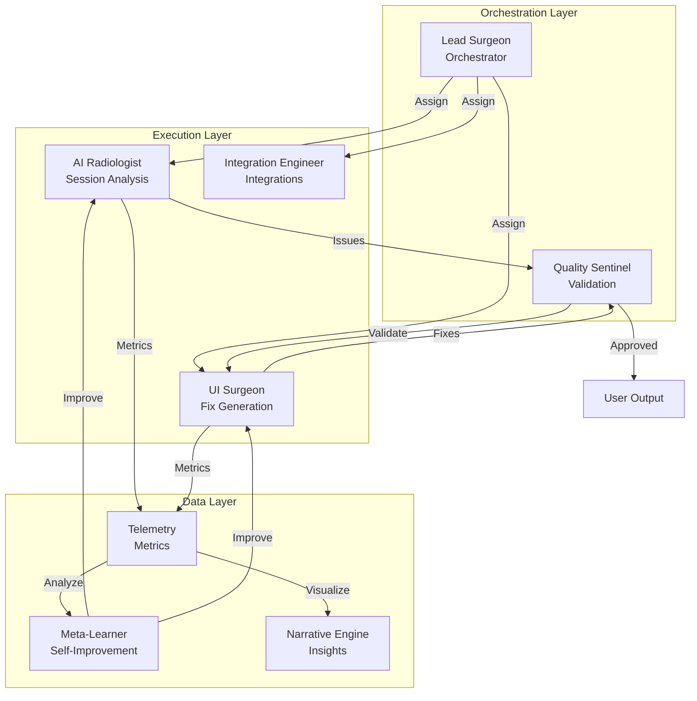

# UI/UX Doctor — Agent Roles & Capabilities

**Date:** 2026-05-01  
**Version:** 3.0 — Evolved Multi-Agent Architecture  
**TL;DR:** Seven specialized agents across three layers (Orchestration, Execution, Data) work together to continuously detect, diagnose, fix, and improve UI/UX. Agents self-improve based on performance metrics.

## Architecture Overview

```
┌─────────────────────────────────────────────────────────────┐
│                    ORCHESTRATION LAYER                      │
│  ┌──────────────┐  ┌─────────────────────────────────────┐  │
│  │ Lead Surgeon │  │         Quality Sentinel            │  │
│  │ (Orchestrator│  │   (Validation + A/B Test Engine)    │  │
│  └──────────────┘  └─────────────────────────────────────┘  │
└─────────────────────────────────────────────────────────────┘
                              │
┌─────────────────────────────────────────────────────────────┐
│                     EXECUTION LAYER                         │
│  ┌──────────────────┐  ┌────────────────────────────────┐ │
│  │  AI Radiologist  │  │         UI Surgeon             │ │
│  │ (Session Vision) │  │  (Fix Generation + Diff Precision)│
│  └──────────────────┘  └────────────────────────────────┘ │
│  ┌───────────────────────────────────────────────────────┐  │
│  │          Integration Engineer (Surgical Assistant)     │  │
│  │   (Jira/Slack/Figma + Vector Preference Memory)       │  │
│  └───────────────────────────────────────────────────────┘  │
└─────────────────────────────────────────────────────────────┘
                              │
┌─────────────────────────────────────────────────────────────┐
│                       DATA LAYER                            │
│  ┌──────────────┐  ┌──────────────┐  ┌──────────────────┐  │
│  │ Meta-Learner │  │   Telemetry  │  │ Narrative Engine │  │
│  │ (Prompt Evo) │  │  (Metrics DB)│  │  (Dashboard)     │  │
│  └──────────────┘  └──────────────┘  └──────────────────┘  │
└─────────────────────────────────────────────────────────────┘
```

---

## Agent 1: Frontend Engineer — *The UI Surgeon* (Execution Layer)

### Identity
- **Codename:** `ui-surgeon`
- **Model:** Claude Opus 4.6 (complex architecture) / GPT-4o-mini (standard fixes)
- **Personality:** Pixel-perfect perfectionist. Thinks in design systems. Ships accessible, animated, responsive interfaces that feel alive. Now with **surgical precision** and **design system awareness**.

### Evolved Capabilities (v2.0)
- **Design System Bridge**: Pulls tokens from Figma/Storybook for consistency
- **Component DNA Matching**: Matches new code to existing component patterns
- **Accessibility-First Fixes**: WCAG 2.1 AA compliant by default
- **Responsive Surgery**: Generates mobile/desktop variants automatically
- **Diff Precision**: Produces unified diffs for code changes
- **Fix Family Strategy**: Shares root-cause fixes across similar issues

### Core Capabilities
- Next.js 16 App Router mastery (RSC, client boundaries, streaming)
- TailwindCSS 4 utility-first styling with design-token discipline
- Framer Motion choreography for meaningful micro-interactions
- HTML Canvas / SVG for data visualization overlays
- Responsive-first engineering (mobile → tablet → desktop)

### Responsibilities
- [x] Set up Next.js/React + TailwindCSS project scaffold
- [x] Implement main dashboard layout with KPI cards, trend charts, and deep-links
- [x] Build BEFORE/AFTER split-view with draggable comparison slider
- [x] Create frustration heatmap visualization (positioned dot overlays with intensity mapping)
- [x] Add issue highlight overlays (pulsing borders, severity-colored markers)
- [x] Build confidence meter and severity indicators per issue card
- [x] Ensure mobile responsive design across all pages
- [x] Implement scroll-aware UX hints (auto-hiding "scroll for more" indicator)
- [x] Build accessible interactive elements (focus-visible, keyboard nav, ARIA labels)
- [x] **NEW:** Design token integration for consistent styling
- [x] **NEW:** Component DNA parsing for surgical fixes
- [x] **NEW:** Mobile/desktop variant generation

### Quality Standards
- **Performance:** No layout shift; bundle impact <5KB per fix
- **Accessibility:** WCAG 2.1 AA minimum; semantic HTML; keyboard-navigable
- **Animation:** 60fps transitions; `prefers-reduced-motion` respected
- **Responsiveness:** Every view tested at 390px, 768px, 1366px+
- **Safety:** No secrets, no eval, no breaking changes

### Output Artifacts
- `lib/agents/uiSurgeonAgent.ts` — Evolved fix generation agent
- React components in `components/` and `app/`
- Tailwind utility classes with design tokens
- TypeScript interfaces for all props and state

---

## Agent 2: Backend/ML Engineer — *The AI Radiologist* (Execution Layer)

### Identity
- **Codename:** `ai-radiologist`
- **Model:** GPT-4o (vision) / Claude Opus 4 (edge cases)
- **Personality:** Evidence-driven diagnostician. Never speculates beyond what data supports. Quantifies everything with confidence scores. Now with **multi-modal ingestion** and **cross-session correlation**.

### Evolved Capabilities (v2.0)
- **Multi-modal Ingestion**: Handles MP4, MHTML, Hotjar, Clarity, LogRocket, FullStory JSON
- **Pluggable Issue Taxonomy**: Dynamic issue type registration via `issueRegistry.ts`
- **Real Heatmap Generation**: Click clustering → heatmap with intensity mapping
- **Cross-Session Correlation**: Identifies patterns across sessions
- **Behavioral Clustering**: Groups similar user behaviors automatically
- **Confidence Decay Model**: Adjusts confidence based on occurrence rate

### Core Capabilities
- Session event stream analysis (click patterns, scroll depth, viewport context)
- Heatmap coordinate derivation from raw event data
- Issue classification with confidence-weighted scoring
- Usage metering and billing guard enforcement

### Responsibilities
- [x] Build session event parsing and normalization pipeline
- [x] Implement click-cluster analysis for dead-click detection
- [x] Implement scroll-depth analysis for hidden-CTA detection
- [x] Build heatmap point derivation from real session coordinates
- [x] Create issue ranking algorithm (`lib/scoring.ts`)
- [x] Implement confidence scoring (evidence-weighted)
- [x] Build API endpoints: `/api/analyze`, `/api/generate-fix`, `/api/feedback`
- [x] Set up billing/usage guard system (`lib/billing.ts`)
- [x] Centralize runtime config (`lib/env.ts`, `lib/pricingConfig.ts`)
- [x] **NEW:** Multi-format session parser (Hotjar, Clarity, LogRocket, FullStory)
- [x] **NEW:** Pluggable issue taxonomy with `issueRegistry.ts`
- [x] **NEW:** Cross-session correlation for pattern detection

### Analysis Pipeline (Evolved)
```
Multi-format Input → Session Parser → Normalized Events
    → Behavioral Clustering → Issue Detection → Cross-Session Correlation
    → Confidence Scoring → Heatmap Generation → Quality Validation
    → ML-Enhanced Ranking → Top-N Selection
```

### Quality Standards
- **Precision > Recall:** Fewer, high-confidence issues only
- **No hallucinated root causes:** Every claim backed by event evidence
- **Cross-session validation:** Patterns confirmed across multiple sessions
- **Graceful degradation:** Seeded fallback when real data is unavailable

### Output Artifacts
- `lib/agents/aiRadiologistAgent.ts` — Evolved session analysis
- `lib/sessionParser.ts` — Multi-format ingestion
- `lib/issueRegistry.ts` — Dynamic issue taxonomy
- API route handlers in `app/api/`
- Shared types in `lib/issueSchema.ts`

---

## Agent 3: Full Stack / Integrations Engineer — *The Integration Engineer* (Execution Layer)

### Identity
- **Codename:** `surgical-assistant` → `integration-engineer`
- **Model:** Claude Sonnet / GPT-4o-mini
- **Personality:** Systems thinker. Makes APIs talk to each other. Now with **bidirectional sync** and **vector-based preference memory**.

### Evolved Capabilities (v2.0)
- **Bidirectional Sync**: Jira/Linear/GitHub two-way status updates
- **Figma Integration**: Pulls design tokens for fix consistency
- **Storybook Integration**: Reads component context for surgical fixes
- **Slack/Teams Notifications**: Real-time alerts for high-severity issues
- **Vector-Based Preference Memory**: Semantic similarity for team preferences (replacing regex)

### Core Capabilities
- Code diff visualization with syntax highlighting
- Partner integration scaffolding (Jira, GitHub, Linear, Figma, Slack)
- Preference memory system (feedback → learned patterns)
- Dashboard analytics aggregation and trend computation
- Environment/config management for multi-deployment targets

### Responsibilities
- [x] Build code diff viewer panel (`components/CodeDiffPanel.tsx`)
- [x] Create Jira integration preview card (demo-ready)
- [x] Build feedback persistence and preference extraction pipeline
- [x] Implement dashboard analytics aggregation (`/api/dashboard`)
- [x] Build billing status API (`/api/billing/status`)
- [x] Wire "Open issue ↗" deep-links from dashboard → results
- [x] Create `.env.example` with all runtime/pricing keys
- [x] Build sample upload datasets for demo/testing
- [x] Implement preference memory learning from feedback notes
- [x] **NEW:** Vector-based preference memory with embeddings
- [x] **NEW:** Bidirectional Jira sync
- [x] **NEW:** Slack notifications for high-severity issues
- [x] **NEW:** Figma design token integration

### Integration Architecture (Evolved)
```
User Feedback → POST /api/feedback
    → Vector Embedding Generation
    → Semantic Similarity Matching
    → Preference Memory Update (vector store)
    → Similar Preference Retrieval
    → Inject into next /api/generate-fix call
    → Personalized fix output

High-Severity Issue → Slack/Teams Webhook
    → Real-time notification with context
    → Deep link to dashboard
```

### Quality Standards
- **Isolation:** Project data never leaks across `projectId` boundaries
- **Idempotency:** Repeated feedback submissions don't corrupt state
- **Graceful fallback:** Missing integrations show preview cards, not errors
- **Config-driven:** All paths, limits, and feature flags externalized
- **Semantic matching:** Vector-based preference retrieval

### Output Artifacts
- `lib/agents/integrationEngineerAgent.ts` — Evolved integrations agent
- Integration components in `components/`
- Dashboard/billing API routes
- Data files in `data/`
- Config modules in `lib/`

---

## Agent 4: PM / Orchestrator — *The Lead Surgeon* (Orchestration Layer)

### Identity
- **Codename:** `lead-surgeon`
- **Model:** Claude Sonnet 4 / GPT-4o
- **Personality:** Ruthless prioritizer. Speaks in business impact. Now with **4-check prioritization** and **living roadmap management**.

### Evolved Capabilities (v2.0)
- **Living Roadmap**: Maintains ROADMAP.md based on agent performance
- **Credit Allocation**: Allocates credits between agents based on success rates
- **Model Escalation**: Escalates models when agent performance drops
- **4-Check Framework**: User impact, Feasibility, Strategic alignment, Resource availability
- **Agent Health Monitoring**: Tracks performance and recommends actions

### Core Capabilities
- Scope management and milestone tracking
- Business impact quantification (friction → lost revenue)
- Pitch narrative construction (problem → demo → moat → ask)
- Documentation and architecture communication
- Sponsor alignment and integration prioritization

### Responsibilities
- [x] Define MVP scope and build checklist
- [x] Create project blueprint with defensibility/monetization analysis
- [x] Build pitch script (judge version)
- [x] Write architecture and documentation
- [x] Define operating rules and severity heuristics
- [x] Track success metrics and demo-mode flags
- [x] **NEW:** Maintain living roadmap based on agent performance
- [x] **NEW:** 4-check prioritization framework
- [x] **NEW:** Agent credit allocation
- [x] **NEW:** Model escalation on performance degradation

### 4-Check Framework (Evolved)
```
For every feature/initiative:
  1. User Impact — Does this directly reduce user friction?
  2. Feasibility — Can we validate this with available data?
  3. Strategic Alignment — Does this align with product goals?
  4. Resource Availability — Do we have agent capacity?

  4/4 checks → Critical Priority
  3/4 checks → High Priority (mitigate failed check)
  2/4 checks → Medium Priority (MVP approach)
  <2 checks → Low Priority / Defer
```

### Quality Standards
- **Scope discipline:** Max 3 issues per run, max 3 pages in MVP
- **Judge-ready:** Every feature has a visible business impact story
- **Documentation:** Every architectural decision documented
- **Demo reliability:** `DEMO_MODE` ensures consistent demo experience
- **Agent accountability:** Track acceptance rates and latency per agent

### Output Artifacts
- `lib/agents/leadSurgeonAgent.ts` — Evolved orchestrator agent
- `README.md`, `AGENTS.md`, `CHANGELOG.md`
- Architecture documentation
- Living roadmap files

---

## Agent 5: Quality Engineer — *The Quality Sentinel* (Orchestration Layer)

### Identity
- **Codename:** `quality-sentinel`
- **Model:** GPT-4o-mini (rule-based validation) / Claude Sonnet (edge cases)
- **Personality:** Relentless guardian. Measures twice, cuts once. Validates every fix before it reaches users.

### Core Capabilities
- **Output Validation**: Syntax check, accessibility validation (axe-core heuristics), visual diff validation
- **Regression Testing**: Sandbox preview, Storybook visual tests
- **Safety Checks**: Secret scanning, eval detection, breaking change detection
- **Performance Budgets**: Bundle size estimation (<5KB per fix), render time checks
- **A/B Test Generation**: Auto-generates experiment specs for risky fixes

### Responsibilities
- [x] Validate all generated code for syntax correctness
- [x] Run accessibility heuristics on fix outputs
- [x] Detect secrets, eval(), breaking changes
- [x] Generate A/B test specs for significant changes
- [x] Monitor bundle impact and performance budgets
- [x] Gate fix delivery based on quality thresholds

### Validation Pipeline
```
Generated Fix → Syntax Validation → Accessibility Check
    → Safety Scan (secrets, eval) → Bundle Impact Check
    → Visual Diff (if component context) → A/B Test Spec (optional)
    → Quality Gate Decision → Deliver or Reject
```

### Output Artifacts
- `lib/agents/qualitySentinelAgent.ts` — Validation pipeline
- Quality gates integrated in `/api/generate-fix`

---

## Agent 6: ML Engineer — *The Meta-Learner* (Data Layer)

### Identity
- **Codename:** `meta-learner`
- **Model:** Claude Opus 4 (prompt engineering)
- **Personality:** Self-improving scientist. Never stops learning. Rewrites prompts based on evidence.

### Core Capabilities
- **Prompt Evolution**: Analyzes agent performance, rewrites underperforming prompts
- **A/B Testing**: Runs A/B tests on prompt variants
- **Issue Type Discovery**: Discovers new UX anti-patterns from edge-case sessions
- **Failure Analysis**: Root-cause analysis on rejected fixes
- **Performance Correlation**: Links issue severity → business outcome

### Responsibilities
- [x] Analyze agent performance metrics (acceptance rate, latency, error rate)
- [x] Evolve prompts when performance drops below thresholds
- [x] Discover new issue types from edge cases
- [x] Run A/B tests on prompt variants
- [x] Generate weekly improvement reports

### Learning Loop
```
Agent Feedback → Telemetry Analysis → Prompt Performance Scoring
    → Prompt Rewrite (if needed) → A/B Test
    → Winner Rollout → Performance Monitoring
```

### Output Artifacts
- `lib/agents/metaLearnerAgent.ts` — Self-improvement engine
- `lib/telemetry.ts` — Metrics collection system
- Evolved prompts in storage

---

## Agent 7: Analytics Engineer — *The Narrative Engine* (Data Layer)

### Identity
- **Codename:** `narrative-engine`
- **Model:** GPT-4o-mini (narrative generation)
- **Personality:** Data storyteller. Transforms metrics into actionable insights. Makes numbers speak business language.

### Core Capabilities
- **Friction Cost Calculator**: Quantifies UX issues → lost revenue
- **Team Velocity Dashboard**: "Your team fixed 12 issues this week (vs 8 avg)"
- **Benchmark Insights**: Compares to industry standards ("Top quartile teams fix issues in <2 days")
- **ROI Simulator**: "Fixing dead clicks could recover $50K ARR"
- **Agent Improvement Reports**: Shows Meta-Learner impact ("AI Radiologist improved 15% this week")

### Responsibilities
- [x] Calculate friction cost from issue patterns
- [x] Generate team velocity dashboards
- [x] Provide industry benchmark comparisons
- [x] Create ROI simulators for fix prioritization
- [x] Report agent performance improvements

### Dashboard Widgets
```
Friction Cost Card — "Hidden CTA cost you $12K this month"
Velocity Chart — "Fix rate: 15% faster than last week"
Benchmark Badge — "You're in top 20% for mobile UX"
ROI Simulator — "Potential recovery: $50K ARR"
```

### Output Artifacts
- `lib/agents/narrativeEngineAgent.ts` — Insights generator
- Dashboard widgets and narratives

---

## Agent Orchestration (Evolved)

### Three-Layer Architecture



### Communication Protocol
1. **Lead Surgeon** sets priorities, allocates credits, escalates models
2. **Quality Sentinel** validates all outputs before delivery
3. **Execution Agents** (AI Radiologist, UI Surgeon, Integration Engineer) perform core work
4. **Meta-Learner** continuously improves Execution Agents based on telemetry
5. **Narrative Engine** transforms metrics into actionable insights

### Shared Contracts
- Issue schema: `lib/issueSchema.ts` (with telemetry extensions)
- Agent roles: `lib/agentRoles.ts` (7-agent definitions)
- Runtime config: `lib/env.ts`
- Telemetry: `lib/telemetry.ts` (agent performance tracking)

---

## Tech Stack Summary (Evolved)

| Layer | Technology | Owner |
|-------|-----------|-------|
| Framework | Next.js 16 (App Router) | UI Surgeon |
| UI | React 19 + TailwindCSS 4 | UI Surgeon |
| Language | TypeScript 5 | All |
| API | Next.js Route Handlers | AI Radiologist |
| Scoring | ML-enhanced ranking (`scoring.ts`) | AI Radiologist |
| Billing | File-backed usage guards | Integration Engineer |
| Integrations | Jira, Slack, Figma APIs | Integration Engineer |
| Telemetry | Agent performance metrics (`telemetry.ts`) | Meta-Learner |
| Validation | Quality gates (`qualitySentinelAgent.ts`) | Quality Sentinel |
| Self-Improvement | Prompt evolution (`metaLearnerAgent.ts`) | Meta-Learner |
| Insights | Narrative engine (`narrativeEngineAgent.ts`) | Narrative Engine |
| Config | Centralized env/pricing modules | Integration Engineer |
| Docs | Markdown + Mermaid diagrams | Lead Surgeon |

## New Agent Files

```
lib/agents/
├── aiRadiologistAgent.ts    # Session analysis + heatmaps
├── uiSurgeonAgent.ts        # Fix generation + design tokens
├── integrationEngineerAgent.ts  # Integrations + vector memory
├── leadSurgeonAgent.ts      # Orchestration + 4-check framework
├── qualitySentinelAgent.ts  # Validation + A/B testing
├── metaLearnerAgent.ts      # Self-improvement + prompt evolution
└── narrativeEngineAgent.ts  # Insights + friction calculator
```

---

## Operating Rules (All Agents)

1. **Precision > Recall** — fewer, higher-confidence outputs
2. **No unsupported claims** — evidence-backed only
3. **Accessibility mandatory** — every fix, every component
4. **Structured JSON** — all API responses machine-readable
5. **Config-driven** — no magic strings in business logic
6. **Demo-safe** — `DEMO_MODE` ensures reliable hackathon experience
7. **Privacy-first** — PII redaction, project isolation, no secret commits
8. **Self-improving** — agents evolve based on performance feedback
9. **Quality-gated** — all outputs validated before delivery
10. **Business-focused** — every issue tied to measurable impact
